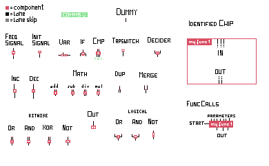
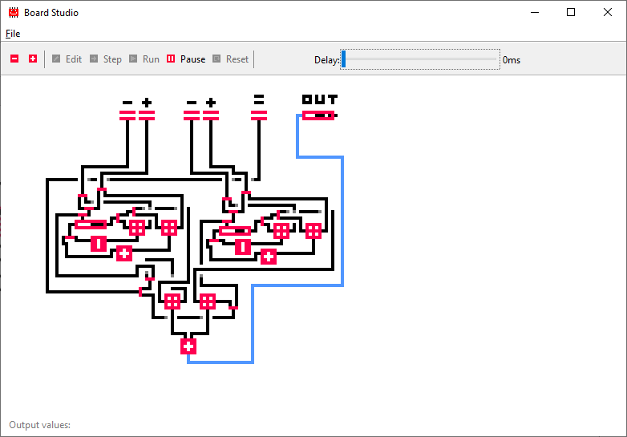

# bildskript
_Version 0.0.1_

This is a simple visual program interpreter. The specification defines
how to draw the components, functions (chips) are not implemented yet:

Editor keys:
*	1	-	Draw component parts (red)
*	2	-	Draw lanes (black)
*	3	-	Draw lane skips (gray)
*	4	-	Draw white
*	s	-	Start/stop selection/action
*	x	-	Cut selected area
*	c	-	Copy selected area
*	v	-	Paste

Have fun!

